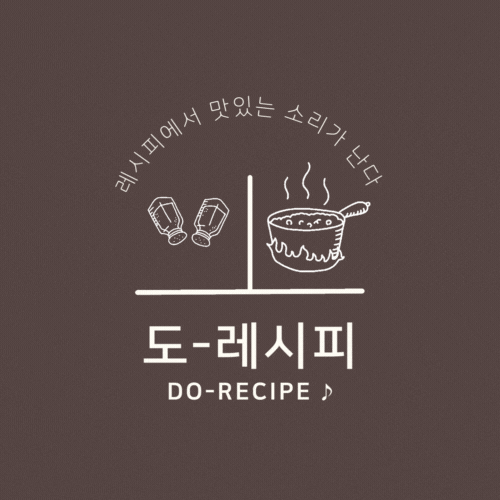

# dorecipe_new

## 도레시피 프로젝트 리뉴얼

* (전)프로젝트 [깃 리포지터리 링크](https://github.com/Choi-yk/DORecipe_back_mybatis) 

* (전)프로젝트 소개 및 진행 : [노션링크](https://www.notion.so/pyotato/3-95a65e92a15a44d3abe6204999c5f071)

  
  
---


## `1. 리뉴얼을 진행하고자한 배경`

  1. 첫프로젝트로써 아쉬운 점이 많았다.

  2. 개발 기한 짧음 + 인원 부족 (프론트1 백3)으로 프론트 총담당을 혼자 맡았는데 프로젝트를 마치면서 개선을 해야겠다고 다짐함.

  3. 포트폴리오에 올릴 수 있는 수준으로 개선하고 싶음.

  4. 리액트 및 개발 전반에 대한 공부를 더할 기회.

     

----


## `2. 개선 방향 `

  * `프론트엔드` 

  1. 리덕스 사용의 아쉬움 (회원 정보뿐만 아니라 레시피 등 전역상태관리가 필요한 데이터들을 더 체계적으로 관리하고 싶음) => 리덕스 thunk에서 saga로 교체하고 싶음
  2. 리액트 쿼리 사용해보고 싶음 
  3. 프로젝트가 가벼워지도록 라이브러리 사용을 줄이고 싶음 (전프로젝트 진행하면서 프론트/백업무를 구분하지 않고 모두 해야하는 상황이 돼버림 => 아이콘 디자인 등 관련 부트스트랩만 남기고 기능은 직접개발하자)
  4. 반복코드, 컴포넌트 분리 작업이 필요함 ~~(3의 문제 때문에 컴포넌트 분리가 원할하지 않아짐)~~
  5. eslint 및 prettier 설정을 잡고 가고 싶음 (변수 명명 방식 통일,형식통일 등등)
  6. 코드 정리 (내부 style css 및 돔에 직접 접근한 코드는 리액트에 맞게 수정)
  7. 관리자 홈 화면을 따로 만들어주고 싶음 (네비바에서 일일이 찾아 들어가는 대신 관리자 홈에 모아두는 형식)
  8. 이미지 등록방식 통일 : 3의 문제로 input태그로 그냥 이미지를 넣는 방식과 리액트 dropzone을 활용한 방식이 혼합되어 있었는데 ,리액트 dropzone으로 모두 통일하기
  9. 에러처리 개선: 데이터들이 로딩 중일 때, 데이터를 전송하는 거에 실패했을때 , 해당 정보를 불러오지 못했을떄 화면 및 기능 추가
  10. alert로 줬던 이벤트들을 직접 모달/팝업창으로 구현하기 
  11. 미디어쿼리 적용해보기
  12. 폴더 구조 정리

  * `백엔드` 

  1. 레시피 등록과 임시 등록 기능에 버그가 많음.

  2. 카카오API를 활용한 로그인 적용해보고 싶음.

  3. 회원 탈퇴와 회원 정보 수정 등이 불가능한 상태. 
  4. 프로젝트 기한이 부족하여 좋아하는 레시피에 하트를 줄 수 있는  `레시피 좋아요`기능 구현 못함.
  5. 레시피에 코멘트(댓글& 이미지)삭제 기능 구현 X.
  6. 네이버 클라우드 플랫폼 활용하여 `레시피 읽어주기` 밑 `페이지 번역`기능을 추가하고 싶음 ~~(시간관계상 기획만 했던 기능)~~ .
  7. 배포시 데이터를 가져오지 못함 (기회가 된다면 배포도 다시 해보고 싶다).
  8. 레시피 동영상 첨부기능 구현 ~~(embed형식만 들어가서 링크만 올린 거는 표시가 안됨).~~
  9. db 수정 : 로그인 관련 필요하지 않다고 판단한 칼럼들은 삭제하고 , 칼럼들의 길이 (코멘트 작성,제목,레시피동영상 등등)를 늘려줘서 alter하기.

  * `기타`

  1. 웹디자인이 매우 불만족스러움 
     * [figma로 새롭게 레이아웃 디자인](https://www.figma.com/file/Sb6EbxPf2SpXOYYy9xmuH9/Dorecipe_new?node-id=9%3A493&t=risd3ijXup6KK6U1-0)
       * 레시피 등록 시 레시피id데이터를 먼저 주고 받은 id로 나머지 레시피 데이터를 줘야하는데 이 단계를 분리할때 사용자가 어색함을 느끼지 않도록 swiperjs(라이브러리)를 사용했는데, 예상치 않은 오류들 ~~(스와이프가 중간에 멈춰서 화면배치에 이상이 생긴다던가)~~ 이 발생했는데, 레이아웃을 변경하여 해당 부분에는 스와이퍼를 사용하지 않아도 되도록 함.

---


## `3. 리뉴얼 프로젝트 진행`

* 기간: 2022/11/26 ~

  * `11/26`

    * 메인화면 : best 레시피 항목들이 보이도록 
    * 레시피 좋아요 기능 추가
    * figma 레이아웃 디자인
    * 변경한 디자인 퍼블리싱작업
    * 글꼴 및  style 전역으로 사용가능하도록 themeprovider 사용
---
  * `11/28`
    * 메인페이지: best레시피 section css 수정
    * 헤더푸터 밀린 거 css 보완
   * 부트스트랩 제거
---
  * `11/30`

    * 레시피 검색(상세검색 페이지) figma 디자인 + 퍼블리싱

    * 회원 가입페이지 figma 디자인  + 퍼블리싱

    * 회원 가입 시 프로필 사진 등록 기능 추가

    * 로그인 페이지 - 로그인 실패 시 오류화면 추가

    * Issues

    ```
      메인페이지 
      ㄴ 베스트레시피 1번부터순서대로 나오도록 수정해야함 
      ㄴ스크롤계산해서 smoothscroll하도록 변경 
      ㄴ푸터 디자인변경 및 sns로고 추가 
      ㄴ svg current에러 해결
    ```

---

  * `12/01`

    * 레시피 상세페이지 디자인변경 figma 디자인 + 퍼블리싱
    * 레시피 영상 url 있을때만 보이도록 
    * 회원 아이디 대신 닉네임 표기하도록 수정

---

  * `12/02`

    * 이미지 파일 대신 svg 사용 [svg 사용에 대한 정리는 여기](https://github.com/Pyotato/TIL/blob/master/ReactStudy/svg_with_react.md)
    * 코멘트 삭제시 코멘트 컴포넌트 리랜더링 되도록 dependency 추가

---

  * `12/05`

    * 레시피 등록 페이지(기본등록사항) 
      * 동영상 url 설명창 모달기능 추가
      * 퍼블리싱
    * 레시피 상세페이지 
      * 동영상 url보이도록 
      * db: recipe_url들어가도록 recipe 테이블 column alter

---

  * `12/06`

    * 레시피 등록 페이지 
      * 동영상첨부 설명 모달창 height수정 
      * 재료등록 section 
        * 퍼블리싱 
        * 재료등록한 리스트보이도록 표시
        * 재료 삭제 기능 수정 (리스트의 첫번째 항목 삭제=> 리스트의 마지막 추가 항목 삭제)
        * 레시피등록 후 재료등록버튼으로 임시저장하도록 버튼수정 
        * 요리순서section
        * 퍼블리싱
        * 이미지 dropzone 반복 코드 제거
---

  * `12/07`
  
    * 레시피 등록 section 
    * 완성사진&팁 퍼블리싱
    * 요리순서 추가/제거버튼 sticky로 수정(추가할때 영역따라가게)
    * 레시피 등록 페이지 
      * 완성사진&등록 버그해결 (저장은 되는데 데이터가 보내지지 않았음)
    * 공지사항페이지 
      * 퍼블리싱
      * 목록으로버튼추가
---
  * `12/08`
    * db 수정 
      * 회원탈퇴 & 회원정보 수정 가능하도록 delete/update on cascade fk 설정 
    * 관리자 페이지
      * 퍼블리싱
      * 관리자 홈 화면 추가 
      * 공지사항,이벤트,노하우 컴포넌트 분리 
      * 공지사항& 이벤트페이지 완성 (이벤트 이미지 업로드/미리보기 기능 dropzone으로 ~~수정중~~ `12/09 수정완료`)

---

* 12/09
  * 관리자 페이지 
    * 관리자홈 퍼블리싱 완성
    * 노하우 리스트, 이벤트 리스트, 공지사항 리스트 등 로딩 중 로딩바추가
    * /admin으로 입력해서 들어왔을때 접근가능한 거 수정

---

* 12/10
  * ''찾을 수 없는 페이지''추가 및 퍼블리싱
    * `레시피 없는 번호일떄도 작동하도록 수정해야함 (현재는 integer형식이 아닌 경우에만 정상작동) `
  *  레시피 제목(키워드) 검색 페이지 퍼블리싱
    * 레시피 검색 키워드 단어 강조하도록 수정함
    * 레시피 검색 키워드에 해당 검색 결과 개수 표시함

* 12/11
  * 공지사항 페이지
    * 로딩바 추가
  * 마이페이지
    * 회원이 좋아요 누른 레시피 가져오기 기능 (백)
    * 회원이 받은 레시피 좋아요 가져오기: 좋아요 많이 받은 순으로 (백)
      * table alter (count 정보 담을 recipe_count 칼럼 추가)
    * 마이페이지 figma로 화면 디자인
    * 회원정보 section 퍼블리싱
      * 네비바로 해당 영역 스크롤
* 12/11
  * 마이페이지 
    * 퍼블리싱
